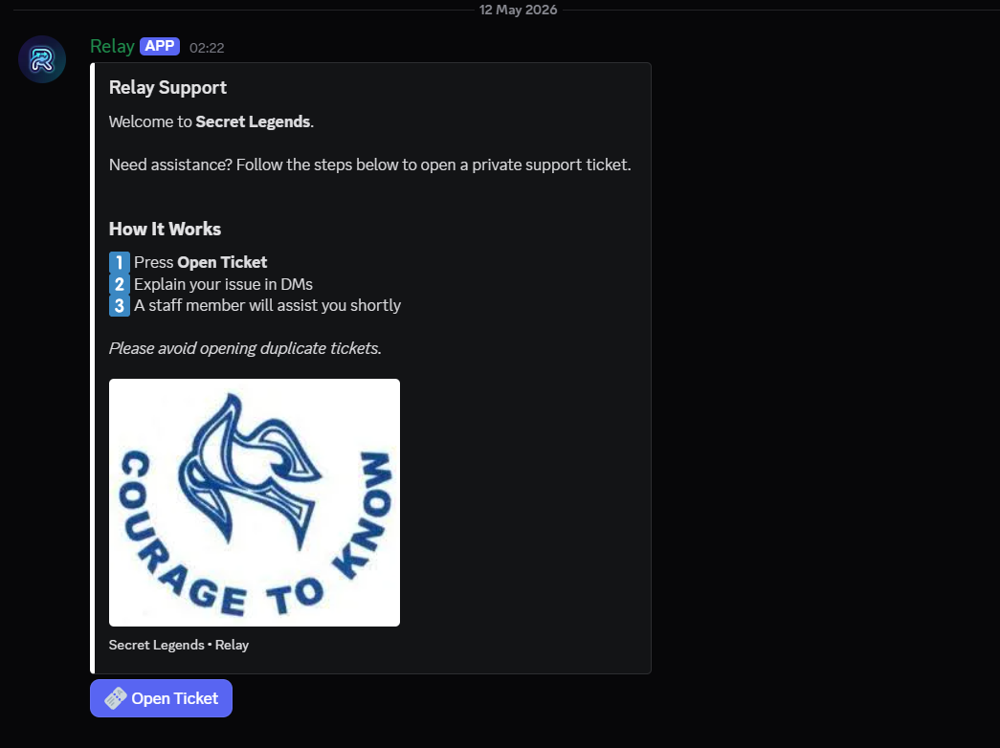
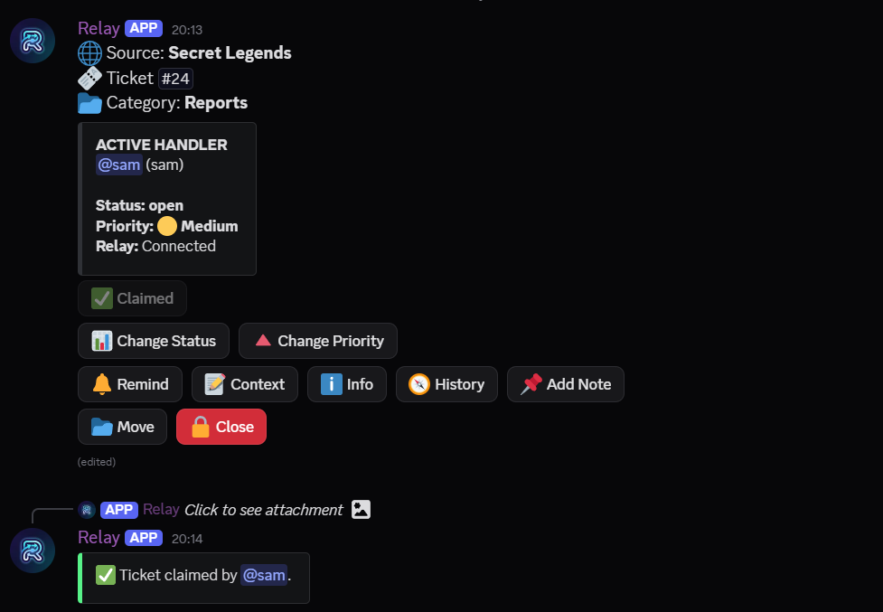
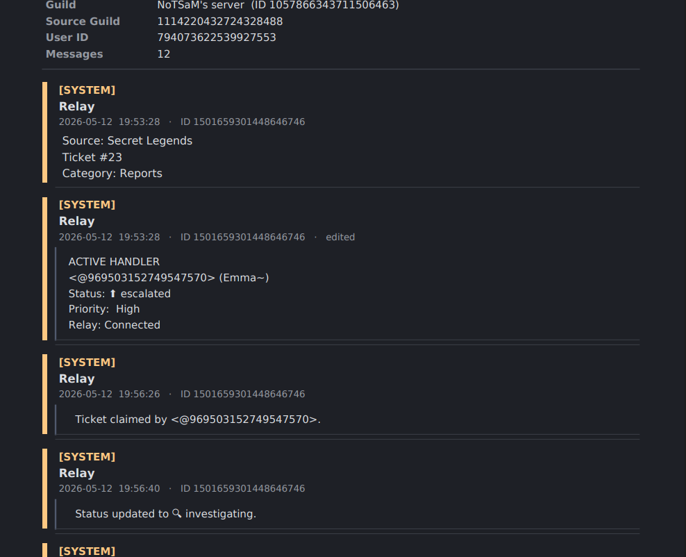
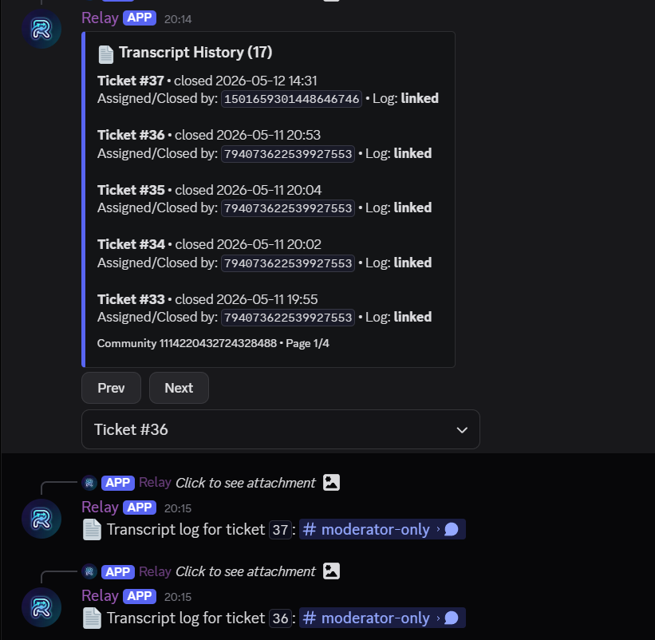

# Relay

<p align="center">
  
  
  
</p>

<p align="center">
  <b>A persistence-first cross-server moderation operations platform for Discord communities.</b>
</p>

<p align="center">
  Built from real moderation experience inside active online communities.
</p>

---

# What is Relay?

Relay is not a traditional Discord ticket bot.

It is a workflow-oriented moderation and support operations platform designed around how real moderation teams actually operate:

* escalations
* investigations
* ownership
* continuity
* evidence collection
* handoffs
* operational recovery
* long-running support workflows

Relay was built from actual moderation experience inside live online communities.

The project started with a simple realization:

> Most Discord ticket bots create channels.
> Very few create operational continuity.

Relay exists to solve that.

---

# Core Philosophy

Relay is built around one principle:

> moderation workflows should survive people, downtime, restarts, and operational chaos.

Traditional systems often break when:

* moderators go offline
* tickets get reassigned
* investigations become long
* the bot restarts
* context gets lost
* staff forget workflow state

Relay was engineered specifically to prevent that.

---

# Cross-Server Relay Architecture

Relay connects:

```text
Community Server
        ↕
Support / Moderation Server
```

Users open support tickets directly from their own community server.

Moderators handle investigations privately inside a dedicated support server.

Communication is bridged through Relay.

This creates:

* cleaner moderation operations
* private investigation space
* centralized moderation handling
* separation between users and staff operations

without forcing users into staff infrastructure.

---

# Major Features

# Interactive Operational Dashboard

Relay replaces command-heavy workflows with a discoverable operational dashboard.

## Queue State

Unclaimed tickets only show:

* Claim Ticket

## Claimed State

Once claimed, Relay transforms into a full moderation dashboard featuring:

* Status management
* Priority management
* Reminders
* Context summaries
* Investigative continuity
* Notes
* Move controls
* Close workflow

The dashboard dynamically adapts based on:

* ticket ownership
* workflow state
* moderator permissions
* operational context

---

# Workflow State System

Relay includes structured workflow tracking.

## Statuses

* Open
* Investigating
* Waiting User
* Escalated
* Resolved

## Priority Levels

* Low
* Medium
* High

Returning a ticket to:

```text
OPEN
```

returns it back to queue state and restores reassignment availability.

---

# Investigative Continuity

One of Relay’s core systems.

Relay preserves investigation continuity through:

## `/context`

Operational summaries used for:

* escalations
* higher-up review
* investigation handoffs
* long-ticket summarization

Example:

```text
User purchased rank but did not receive permissions.
Payment verified. Awaiting admin synchronization confirmation.
```

---

## `/info`

Structured operational identity view containing:

* user profile
* account metadata
* ticket history count
* operational information
* staff-facing investigation context

---

## `/history`

Continuity retrieval system featuring:

* note history
* transcript history
* operational evidence continuity

History is scoped per community to prevent cross-community information leakage.

---

# Notes System

Relay supports structured staff notes.

Features:

* moderator-authored investigation notes
* operational continuity tracking
* historical evidence retention
* pagination support
* permission-aware access

Notes are designed specifically for:
internal investigation continuity.

---

# Transcript System

Relay transcripts are investigation-aware.

Unlike traditional ticket transcripts, Relay preserves:

* operational threads
* evidence dumps
* internal investigation discussions
* structured operational metadata

## Features

* Thread-aware transcript capture
* Role-aware rendering
* Historical transcript indexing
* Continuity integration
* Transcript jump navigation

Relay intentionally avoids exposing sensitive internal investigations directly to ticket creators.

---

# Reminder System

Moderators are not expected to sit inside inactive tickets all day.

Relay includes:

```text
/remind
```

which allows moderators to:

* leave inactive tickets safely
* receive automatic response pings
* reduce operational fatigue
* maintain workflow efficiency

The system automatically clears reminders after response detection to avoid notification spam.

---

# Permission Architecture

Relay supports hierarchical moderation permissions.

Using:

```text
/staffroles
/staffperms
```

servers can create moderation structures such as:

* Trial Moderators
* Moderators
* Senior Moderators
* Administrators

Permissions apply consistently across:

* slash commands
* dashboard controls
* operational workflows
* continuity systems

Dashboard controls cannot bypass permissions.

---

# Persistence-First Design

Relay was intentionally engineered around database authority.

The database is authoritative.

This means:

* tickets survive restarts
* workflows recover automatically
* dashboard state reconstructs safely
* continuity never disappears
* deferred operations retry automatically

Relay was specifically designed so that:

> taking the bot offline for updates does not destroy active moderation workflows.

---

# Rename Governance System

Discord channel rename rate limits are aggressive.

Relay includes a governed rename architecture featuring:

* rolling rename budgets
* deferred rename queues
* automatic resynchronization
* restart-safe recovery

If rename limits are exhausted:
Relay defers the rename safely instead of breaking workflows.

When budget returns:
the channel automatically synchronizes to the latest workflow state.

No stale workflow replay occurs.

---

# Operational Help System

Relay includes an interactive handbook-style help system.

```text
/help
```

is not just a command list.

It teaches:

* workflow philosophy
* operational usage
* moderation flow
* dashboard behavior
* continuity systems

Features:

* interactive embeds
* dropdown navigation
* onboarding guidance
* moderator-first explanations

---

# Onboarding & Safety Systems

Relay includes operational guardrails such as:

## `/leave` Confirmation

Users must explicitly confirm before disconnecting relay sessions.

## First-Time Moderator Guidance

New moderators receive contextual onboarding tips.

## Setup Guidance

New servers receive onboarding information automatically.

The goal is:
discoverability without operational clutter.

---

# Thread-Aware Evidence Collection

Relay supports hidden investigative threads inside tickets.

This allows moderators to:

* dump evidence
* coordinate internally
* separate investigation material from user conversation

Thread content is preserved inside transcripts for continuity.

---

# Technical Architecture

## Stack

* Python
* discord.py
* SQLite
* Persistent Discord UI Views
* Async workflow architecture

## Design Patterns

* Database-authoritative state
* Persistent operational recovery
* Centralized permission management
* Interaction-safe workflows
* Deferred retry systems
* Workflow-oriented UI architecture

---

# Why Relay Exists

Relay was built because moderation teams constantly deal with:

* lost context
* abandoned tickets
* chaotic escalations
* inconsistent workflows
* forgotten investigations
* moderator fatigue
* operational clutter

Every Relay system exists because at some point:
a real moderation workflow needed it.

This project was not built from theoretical assumptions.

It was built from actual operational moderation experience.

---

# Development Progress

## Phase 1

Core relay infrastructure

## Phase 2

Operational utility systems

## Phase 3

Cross-server relay architecture

## Phase 4

Operational continuity, dashboards, transcripts, onboarding, permissions, workflow intelligence, and persistence systems

---

# Future Direction

Potential future expansion areas:

* AI-assisted summaries
* intelligent escalation support
* operational analytics
* SLA tracking
* automated investigation tooling
* moderation intelligence systems

---

# Screenshots

## Ticket Announcement Panel

The public-facing support entrypoint used by community members to open relay sessions.

<p align="center">
  
</p>

---

## Operational Dashboard

Relay's workflow-oriented moderation dashboard featuring:

* claim ownership
* workflow state management
* reminders
* continuity retrieval
* investigation tooling
* operational controls

<p align="center">
  
</p>

---

## Transcript System

Relay transcripts preserve:

* operational events
* workflow transitions
* investigation continuity
* role-aware rendering
* hidden thread evidence collection

<p align="center">
  
</p>

---

## Transcript Continuity Retrieval

Historical transcript indexing and continuity retrieval system.

Moderators can:

* review prior investigations
* access operational history
* jump directly to transcript artifacts
* preserve long-term moderation continuity

<p align="center">
  
</p>

---

# Installation

```bash
git clone https://github.com/samnotfound31/relay.git
cd relay
pip install -r requirements.txt
```

Create:

```text
.env
```

Example:

```env
BOT_TOKEN=your_token_here
```

Run:

```bash
python -m bot.main
```

---

# Recommended Server Structure

## Community Server

Where users open tickets.

## Support Server

Where moderators investigate and operate Relay workflows.

---

# License

MIT License

---

# Final Note

Relay was never intended to be:
“just another Discord ticket bot.”

It was built to explore what moderation infrastructure could look like if continuity, workflow ergonomics, persistence, and operational intelligence were treated as first-class priorities from the start.

Every major Relay system exists because somewhere during moderation:
someone needed it.
